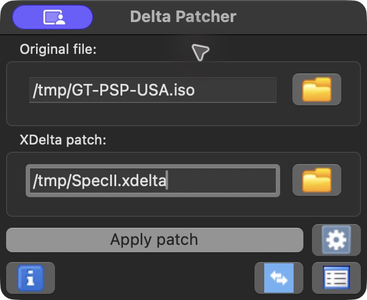
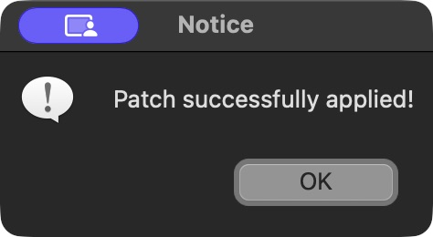

# Install Gran Turismo PSP Career

You need your own unmodified **Gran Turismo PSP USA** ISO. The patch does not include the game.

**[Find the right patch for your ISO](https://memetrix.github.io/gran-turismo-psp-career/)** — choose the ISO file and download the patch it recommends. The check runs on your device; the ISO is never uploaded.

1. Download the recommended `.xdelta`, plus the free [Delta Patcher](https://deltapatcher.net/) for Windows or macOS.
2. Make a copy of your original ISO. In Delta Patcher, choose the copy under **Original file**.
3. Choose the downloaded `.xdelta` under **XDelta patch** and click **Apply patch**. Delta Patcher changes the selected ISO copy. When it reports success, copy that ISO to your PSP's `ISO` folder or open it in PPSSPP.

These are screenshots from an actual installation; your file paths will differ.





If Delta Patcher reports a checksum error, check that you picked the patch for your ISO. A modified ISO or a different region will also fail. Keep checksum validation on. The finished ISO has SHA-256 `1219e55d1fc0352ade90b2853c09de0441990a46407032acdc76c2adcabd31e6` with every supported source.

<details>
<summary>Choose manually using PPSSPP's CRC32</summary>

| Original ISO | CRC32 | Patch |
| --- | --- | --- |
| USA UMD v2.00 | `1EADB6B4` | `GT-Career-SpecII-v0.27.2-beta.1-USA-UMD-v2.xdelta` |
| USA UMD v1.00 | `9613AC93` | `GT-Career-SpecII-v0.27.2-beta.1-USA-UMD-v1.xdelta` |
| Originally supported USA v2.00 image | `71DCC467` | `GT-Career-SpecII-v0.27.2-beta.1.xdelta` |

All three patches are on the [release page](https://github.com/Memetrix/gran-turismo-psp-career/releases/tag/v0.27.2-beta.1) and produce the same beta ISO.

</details>

The European `UCES01245` version is not supported in this beta. European support is planned for the full release.

## Saves

Back up your savedata before trying the beta or updating from an older version. The career uses its own `UCUS98632-CAREER` save. On first launch it can copy your garage and credits from the stock `UCUS98632-GAMEDAT` save without overwriting it. Future beta updates may reset career progress while preserving the garage, credits and licences.

<details>
<summary>Smaller command-line patch (advanced)</summary>

The 81 MB ZIP on the release page is an alternative for users who prefer a smaller download. It currently supports only the originally supported USA v2.00 image (CRC32 `71DCC467`, SHA-256 `78d1b6855a268bd6480a6572977c3f4df4c438af11c751baeca14390819de435`). It is not a `.xdelta` file. It needs Python 3.8+, `xdelta3` on your PATH, the .NET 9 or 10 runtime and about 5 GB of free disk space. Extract the ZIP, then run this from a terminal inside its folder:

```sh
python3 apply_patch.py "/path/to/your/original.iso" "/path/to/Gran-Turismo-PSP-Career-beta.iso"
```

On Windows, use `python` or `py` in place of `python3`. If `dotnet` is not on your PATH, add `--dotnet /path/to/dotnet`. This installer leaves the original ISO untouched.

</details>

For features and known beta limits, see the [release notes](RELEASE-NOTES-v0.27.2-beta.1.md). [Report a problem](https://github.com/Memetrix/gran-turismo-psp-career/issues) with the console model or PPSSPP version, event and round, and what happened.
