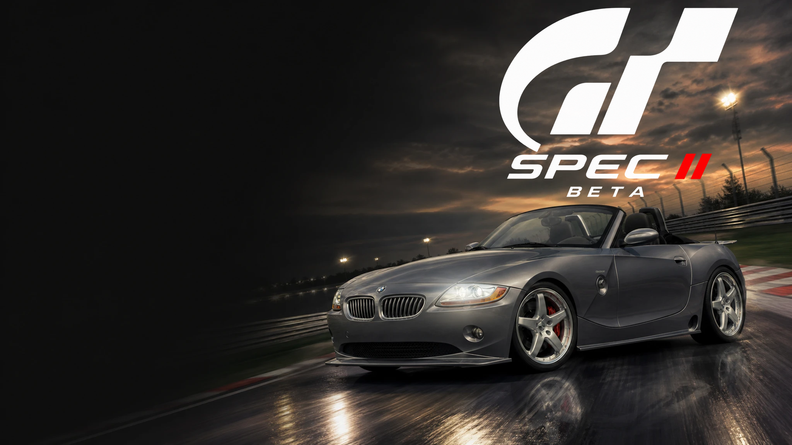
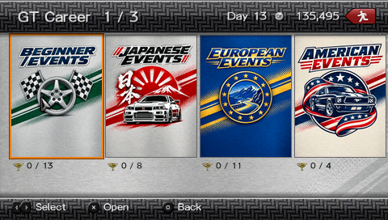
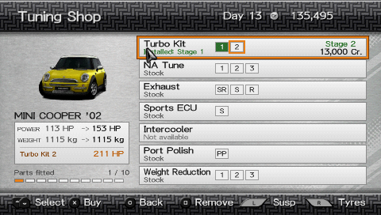
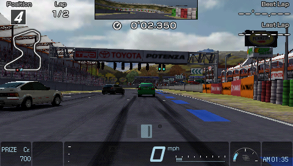

# GT Career: Spec II

An unofficial career mode for Gran Turismo PSP, inspired by GT4 Spec II. This is a public beta.

**[Download the beta patch](https://github.com/Memetrix/gtpsp-career-spec-ii/releases/latest)** · [Installation and known limits](INSTALL.md) · [Credits and licences](NOTICE.md)

The release is a patch for a user-owned, unmodified **Gran Turismo PSP USA UCUS98632 v2.00** ISO. It does not contain the original game image or a save file. The installer checks the original ISO and the finished image by SHA-256.

The current catalog has nine halls, 161 GT4-derived competitions, connected long series, two PSP-specific lost-circuit events, and two named hidden-course diagnostics. It includes engine, suspension, tyre and brake tuning, persistent purchases, and segmented endurance with cumulative classification. See [INSTALL.md](INSTALL.md) for the exact beta limits and hardware evidence.

These screenshots are direct, unscaled 480×272 PSP framebuffer captures from PPSSPP running the exact beta ISO:

The GPL-3.0 source snapshot, modified volume-tool source diff, patch installer, and licence notices are included in the release bundle. Please report issues with your console model or PPSSPP version, event and round, and whether the problem survives a cold launch.
