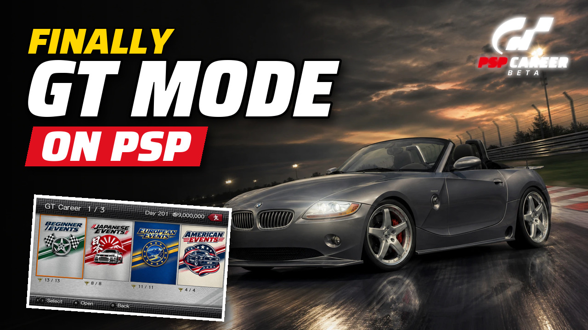
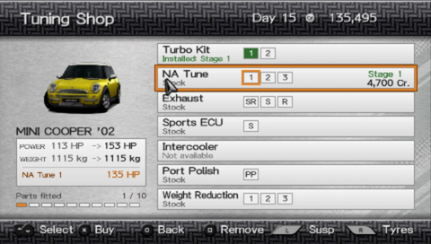
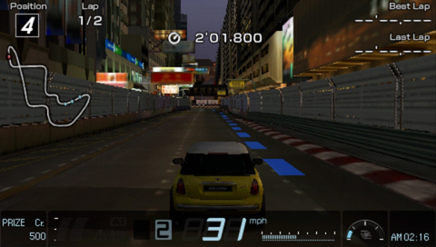
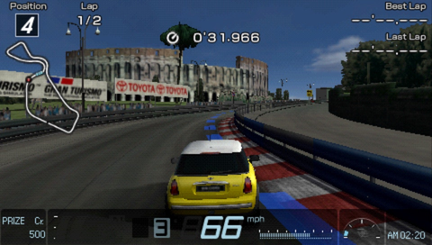
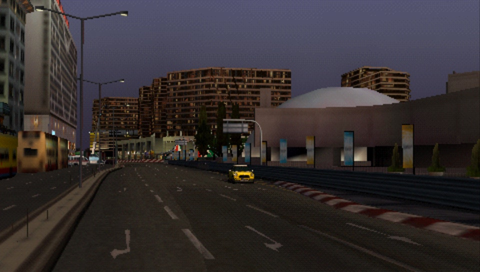
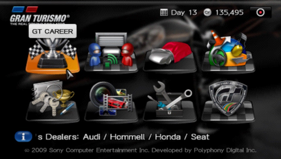
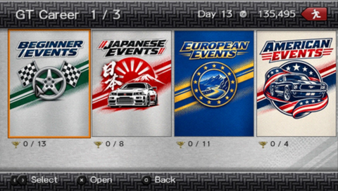
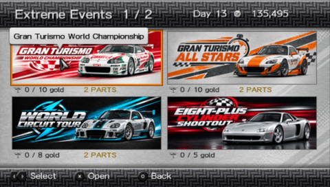
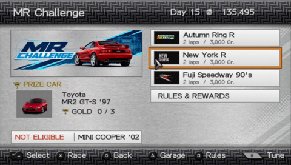

# GRAN TURISMO PSP CAREER

### The career Gran Turismo PSP never got.

**[WATCH THE TRAILER](https://www.youtube.com/watch?v=EhzWIxJF08s)** · **[DOWNLOAD PUBLIC BETA](https://github.com/Memetrix/gran-turismo-psp-career/releases/tag/v0.27.2-beta.1)** · **[INSTALLATION GUIDE](INSTALL.md)** · **[RELEASE NOTES](RELEASE-NOTES-v0.27.2-beta.1.md)**

**163 competitions · 763 rounds · 9 halls · 5 lost tracks on PSP Go**

Gran Turismo PSP has the cars and the driving. **Gran Turismo PSP Career gives them the career they were missing:** 163 competitions, a proper parts shop, prize cars and full-length endurance races.

## Trailer

## Career

<table>
<tr><td width="50%">
<h3>163 competitions</h3>

Nine halls. 763 rounds. Championships, one-make races and two Lost Circuits cups.

</td><td width="50%">
<h3>Progression</h3>

Licences, car eligibility, credits, trophies and prize cars.

</td></tr>
<tr><td>
<h3>Championships</h3>

Full GT4 championships and World Circuit Tour.

</td><td>
<h3>Endurance</h3>

18 full-length events, including 24-hour races.

</td></tr>
</table>

## The tuning shop GT PSP never shipped

GT PSP has Quick Tune, but no parts shop. Gran Turismo PSP Career adds one: buy engine parts, tyres and suspension, fit them, and feel the difference on track. Bought parts stay yours when removed.

<table>
<tr><td width="50%"> Buy and fit engine parts</td><td width="50%"> Adjust a fitted suspension kit</td></tr>
</table>

## Lost tracks on real hardware

Hong Kong, Rome Circuit, Complex String and Smokey Mountain once crashed the PSP. All four now race to the finish on PSP Go. Tahiti Dirt has passed a hardware test too. Two Lost Circuits events put them in the career.

<table>
<tr><td width="50%"> Hong Kong · Lost Circuits Cup</td><td width="50%"> Rome Circuit · Lost Circuits Cup</td></tr>
</table>

 Hong Kong replay

## See the career

<table>
<tr><td> Career entry</td><td> Event halls</td></tr>
<tr><td> World Championship</td><td> MR Challenge</td></tr>
</table>

## Get the public beta

This release has patches for three **Gran Turismo PSP USA** ISO variants. European support is planned for the full release. The patches do not include the game. [Select your ISO to find the right patch](https://memetrix.github.io/gran-turismo-psp-career/), then apply it with the free [Delta Patcher](https://deltapatcher.net/) for Windows or macOS. The game file stays on your device during the check. Copy the finished ISO to your PSP or open it in PPSSPP.

**[Download v0.27.2-beta.1](https://github.com/Memetrix/gran-turismo-psp-career/releases/tag/v0.27.2-beta.1)** · [Detailed installation and save instructions](INSTALL.md) · [Release notes](RELEASE-NOTES-v0.27.2-beta.1.md) · [Credits and licences](NOTICE.md)

For the current beta limits and hardware test status, see the [release notes](RELEASE-NOTES-v0.27.2-beta.1.md) and the [tested-device list](TESTED-DEVICES.md). This is an unofficial fan project; Gran Turismo and the original game assets belong to their respective owners.

Found a problem? [Open an issue](https://github.com/Memetrix/gran-turismo-psp-career/issues) with the console model or PPSSPP version, event and round, what happened, and whether it happens after a cold launch.
