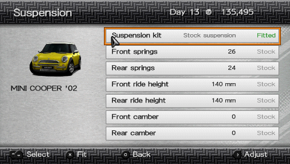
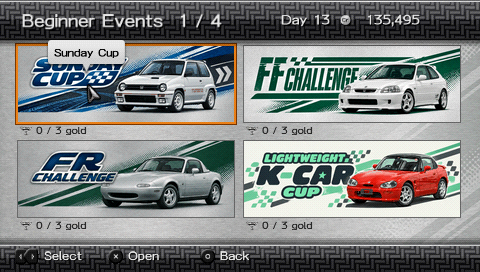
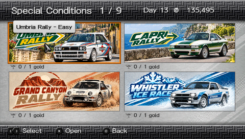
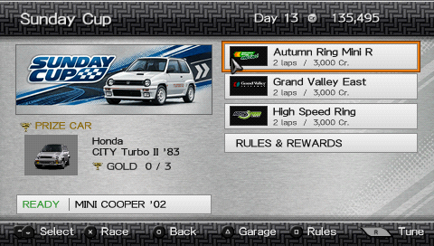
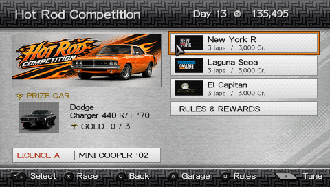
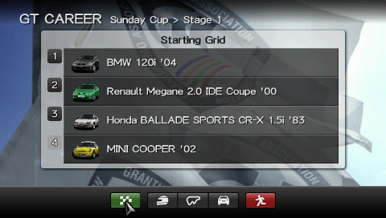

# GT CAREER: SPEC II

### The career Gran Turismo PSP never got.

**[DOWNLOAD PUBLIC BETA](https://github.com/Memetrix/gtpsp-career-spec-ii/releases/tag/v0.27.2-beta.1)** · **[INSTALLATION GUIDE](INSTALL.md)** · **[RELEASE NOTES](RELEASE-NOTES-v0.27.2-beta.1.md)**

| 163 competitions | 763 career rounds | 9 event halls | 4 lost circuits proven on PSP Go |
| :---: | :---: | :---: | :---: |
| GT4 Spec II-inspired career | Cups, tours and championships | Beginner to Endurance | Hong Kong, Rome, Complex String, Smokey Mountain |

Gran Turismo PSP has the cars and the driving. **Spec II adds the career around them:** hundreds of races, a parts shop that changes the car you drive, connected championships, prize cars, and endurance events you can resume. Built for a real PSP, with a separate career save.

## Lost tracks. Real hardware.

**Hong Kong, Rome Circuit, Complex String, and Smokey Mountain used to crash a real PSP. All four now run through complete races on PSP Go.** Hong Kong's map works; Rome counts laps and finishes with AI opponents. The career's *Lost Circuits Cup* and *Lost Circuits Rally* put these recovered courses into playable events instead of burying them in a debug menu.

Tahiti Dirt is also drivable in PPSSPP, but has not yet passed the same hardware check. Complex String and Smokey Mountain still have visible texture defects. The tracks are a recovery in progress, and you can actually race them.

## A career built around the PSP

<table>
<tr><td width="50%">
<h3>Nine halls, 163 competitions</h3>

Beginner, Japanese, European, American, Professional, Extreme, Special Conditions, Endurance, and One-Make. The catalog combines <strong>161 GT4 Spec II-derived competitions</strong> with two Lost Circuits events. Long series use 42 linked continuation cards; altogether the career contains <strong>205 cards and 763 rounds</strong>. Two extra hidden-course diagnostic cards are clearly marked as experiments.

</td><td width="50%">
<h3>Progress that means something</h3>

Win cups, collect trophies, unlock halls, earn credits and prize cars, and meet licence and car requirements. The garage marks eligible cars with <strong>FITS</strong>. The career has its own save slot and can import your existing PSP garage and credits on first launch.

</td></tr>
<tr><td>
<h3>Full championships, shared standings</h3>

Long championships span multiple six-round pages, but remain <strong>one season</strong>: the same rivals, shared 10/8/6/4 points, and the championship reward only after the final round. World Circuit Tour keeps its separate-win rules. Regular races use four-car grids; Special Conditions uses two-car duels.

</td><td>
<h3>Endurance you can put down and resume</h3>

All <strong>18 endurance events</strong> retain their full catalog distances or durations. The 24-hour races are split into 20-minute sessions with cumulative distance, a persistent field of rivals, rolling starts based on the previous result, intermediate saves, and one final payout. Your position across the event matters; merely winning the last session is not enough.

</td></tr>
</table>

## The tuning shop GT PSP never shipped

Buy a part, fit it, remove it, and refit it later without buying it again. The catalog includes native engine upgrades across ten categories—turbo, naturally aspirated tuning, exhaust, ECU, intercooler, port polish, weight reduction, engine balancing, displacement, and supercharger—plus paid tyres and adjustable suspension kits. Applicable brake controls are available too.

These are not just numbers painted into a menu: the car is prepared with the fitted hardware for the race, and acceleration and handling changes have been measured in-game. Purchases persist across saves. The current journal supports up to **192 tuned-car configurations**.

<table>
<tr><td width="50%"> Buy and fit engine parts</td><td width="50%"> Adjust a fitted suspension kit</td></tr>
</table>

## See the career

These are direct **480 × 272 PSP framebuffer captures** from the exact beta ISO in PPSSPP, without UI mockups or upscale.

<table>
<tr><td> Choose a hall</td><td> Work toward the top series</td></tr>
<tr><td> Start with the Beginner events</td><td> Take on two-car rally duels</td></tr>
<tr><td> Each event shows its races, rules and rewards</td><td> Licences and car eligibility shape the route</td></tr>
<tr><td> Meet the field before the start</td><td> Race for credits, trophies and cars</td></tr>
</table>

## Get the public beta

This release is a **patch**, not a game ISO. It applies to an unmodified **Gran Turismo PSP USA UCUS98632 v2.00** image that you supply. The installer checks both the source and finished ISO by SHA-256 and does not overwrite your original. Copy the patched ISO to a PSP or open it in PPSSPP.

**[Download v0.27.2-beta.1](https://github.com/Memetrix/gtpsp-career-spec-ii/releases/tag/v0.27.2-beta.1)** · [Detailed installation and save instructions](INSTALL.md) · [Release notes](RELEASE-NOTES-v0.27.2-beta.1.md) · [Credits and licences](NOTICE.md)

### What “beta” means here

The current gameplay volume was played on PSP Go; this beta's new cover was checked on the device as well. A full accumulated 24-hour event has **not** yet been completed as an acceptance run. Lap-based endurance scoring, some race-result edge cases, AI tuning and pace balance still need work. During a resumed marathon, the first partial lap can display a false best-lap time, although cumulative distance excludes that partial lap. The in-race position guide is an estimate; the confirmed result uses the recorded race position.

The original GT4 missions, B-Spec and unavailable GT4 courses are outside this port. This is an unofficial fan project. Gran Turismo and the original game assets belong to their respective owners. The release contains source code and licence notices, but no copyrighted game ISO or save file.

Found a problem? [Open an issue](https://github.com/Memetrix/gtpsp-career-spec-ii/issues) with the console model or PPSSPP version, event and round, what happened, and whether it happens after a cold launch.
